<!-- README.md is generated from README.Rmd. Please edit that file -->

# gvsu215

<!-- badges: start -->
[](https://CRAN.R-project.org/package=gvsu215)
[](https://lifecycle.r-lib.org/articles/stages.html#stable)
[](https://app.netlify.com/sites/transcendent-starlight-07ae23/deploys)
<!-- badges: end -->

Note: Due to the fact that some functions return tables (which are
essentially HTML code), the README on GitHub does not display properly.
As a result, the output is an image of the resulting table rather than the actual HTML table.

`gvsu215` contains a series of wrapper functions around select
`{mosaic}` and `{ggformula}` functions, with help from `{flextable}`.
The goal is to provide introductory statistics students/learners with an
easy way to generate nice-looking plots and tables without focusing on
the code used to create them. All tables and plots generated from this
package have been doctored and have had themes pre-applied. As such,
output will not print in “messy” format to the R console and can be used
interactively, including in R Markdown documents.

This package was designed and tailored for Grand Valley State University
(course code: STA 215) but can be used by anyone.

## Installation

You can install the development version of gvsu215 from
[GitHub](https://github.com/ian-curtis/gvsu215) with:

``` r
# install.packages("devtools")
devtools::install_github("ian-curtis/gvsu215")
```

## Prerequisites

In order to use this package, you will need a basic understanding of R
syntax and how to run a function in your preferred working environment.
Functions use formula syntax (e.g., `var1 ~ var2`) and thus knowledge of
formulas is needed as well.

## Examples

This package is best used for creating simple plots and charts where
extensive customization is not necessary. For instance, you may just
want to see summary statistics, including one- or two-way tables.

``` r
library(gvsu215)
```

``` r
tbl_2var(mtcars, gear~cyl)
```

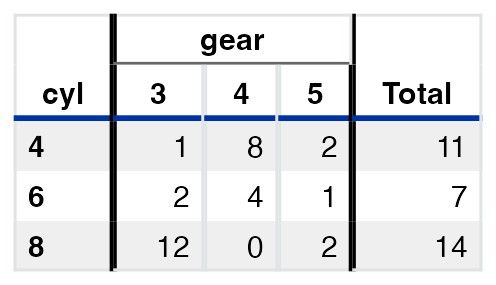

``` r
tbl_num_sum(mtcars, ~wt, na_rm = TRUE)
```

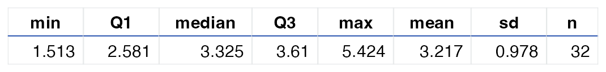

Or maybe you just need percentiles:

``` r
tbl_pctile(mtcars, ~wt, probs = c(0, .25, .4, .5, .6, .75, 1))
```

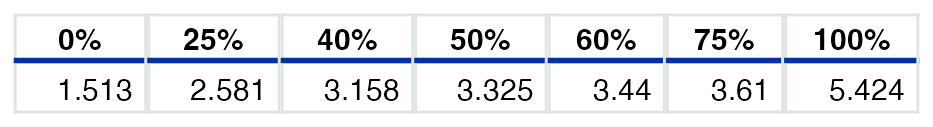

There is also support for a variety of plots…

``` r
plot_bar(mtcars, ~cyl, type = "percent")
```

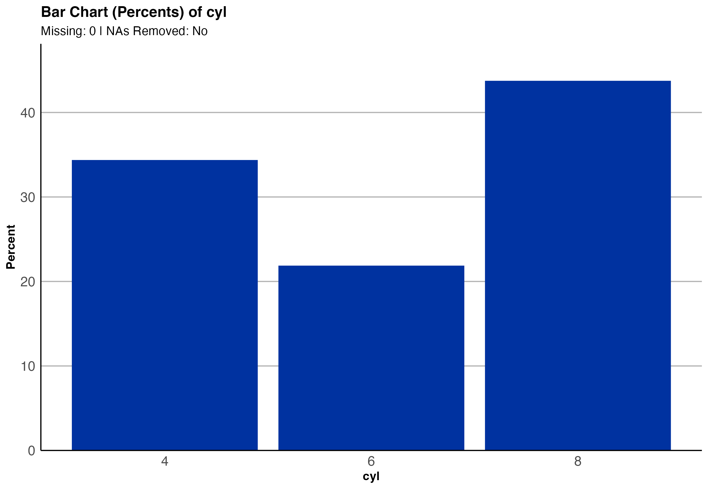

``` r

plot_box(mtcars, 
         wt~gear, 
         fill = 'orangered4', 
         x = "Gear", 
         y = "Weight", 
         title = "Boxplot of Weight by Gear")
```

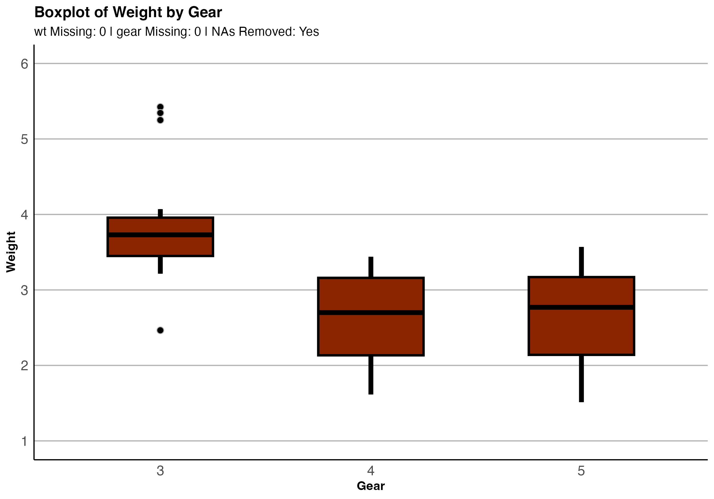

``` r

plot_scatter(mtcars, wt~drat)
#> NAs always removed (in pairs) for scatterplots.
```

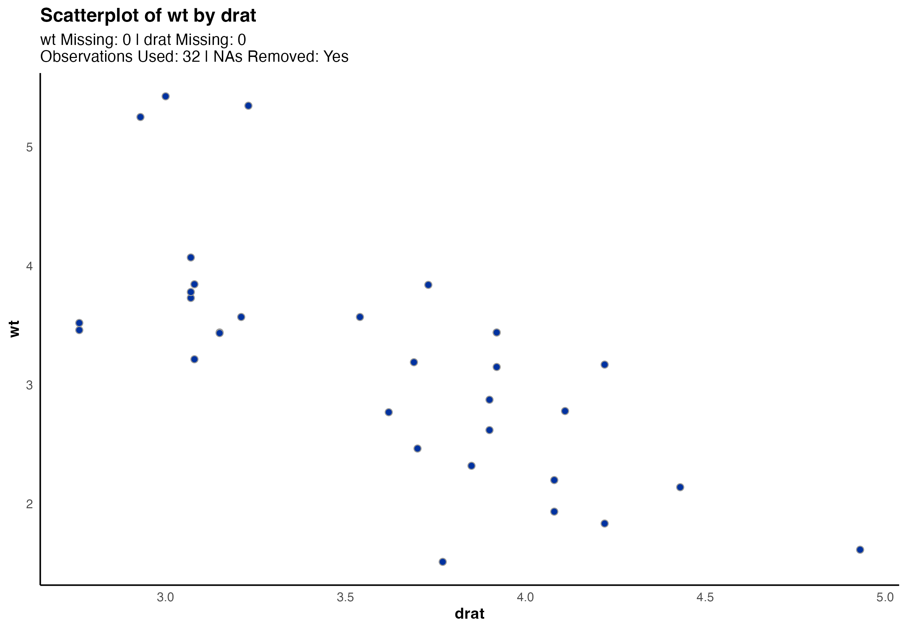

… and statistical inference.

``` r
infer_1prop(mtcars, ~vs, success = 1)
```

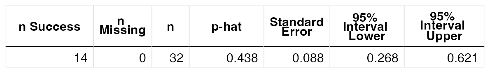

``` r
infer_paired(mtcars, var1 = ~drat, var2 = ~wt)
```

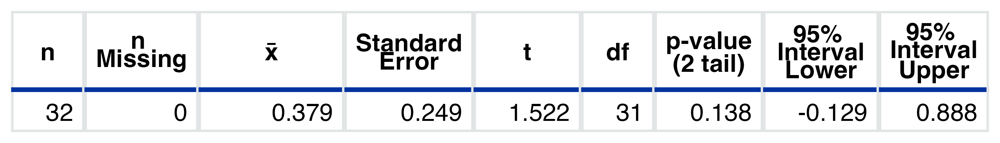

``` r
infer_2mean_int(mtcars, wt~vs)
```

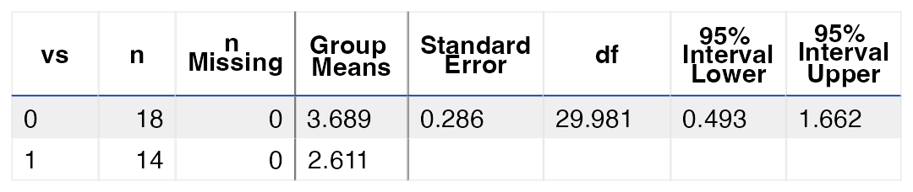

``` r
suppressWarnings(infer_chisq(mtcars, cyl~gear))
```

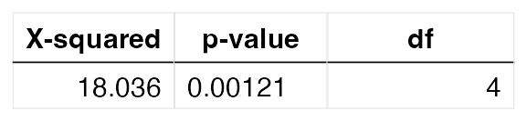

``` r
suppressWarnings(infer_chisq(mtcars, cyl~gear, type = "expected"))
```

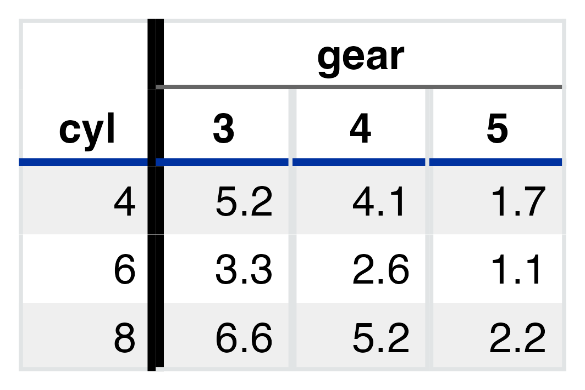

``` r
infer_anova(mtcars, cyl~gear, digits = 2)
```

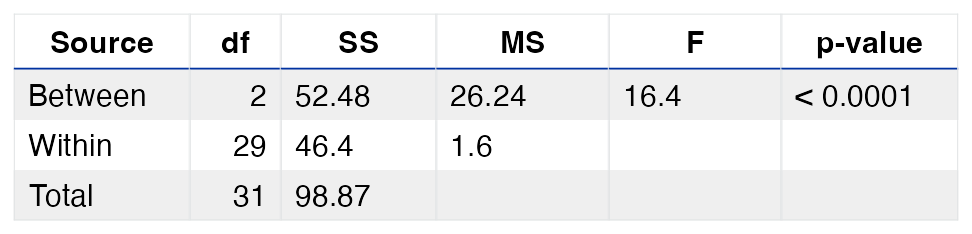

# Help, Bug Reports, and Feature Requests

Errors happen! If you come across an error you don’t think you should
have, feel free to [create an issue on
GitHub](https://github.com/ian-curtis/gvsu215/issues). If you’d like to
suggest a change or addition, you can use the issues page for that, too!
